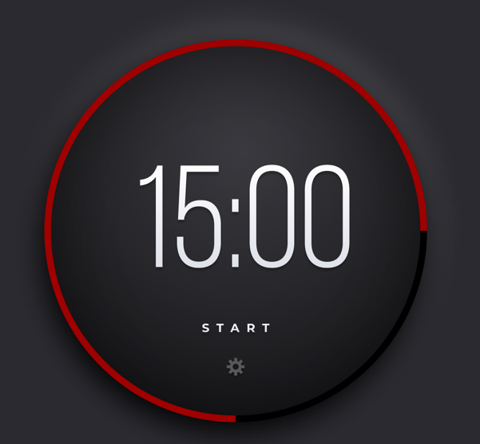

# Brief

In this project, we're creating a Pomodoro timer.

You can use as many (or as few) tools, libraries, and frameworks as you'd like. If you're trying to learn something new, this might be a great way to push yourself.

**Users should be able to:**

-   Start the timer by clicking on the start link/button.
-   Once the user clicks start, the word start will change to stop. Then, the user can click on the stop button to make the timer stop.
-   Click on the gear icon to change the length (minutes and seconds) of the timer.
-   Once the timer finishes, the ring should change from green to red and an alert message is passed to the browser.

# Getting Started

1. To get started, [download the files](https://drive.google.com/drive/folders/1ZwnRTG0A1n5EOgi6HmHDkrFde4yxkhsH?usp=sharing). This includes all the project assets you need to get started: HTML, CSS, images, and fonts.
2. Take a look around. Look at the project's Figma file. This is a great way to see how the pieces and parts should look within the browser.
3. Open the project's `README.md` file (that's this!). It has additional information on how the project is structured.
4. Customize your project / file architecture to your liking.
5. Happy coding!
6. Once you're finished, share your work using **#adventofjs**

# Taking your Project to the Next Level

-   Use a framework like [React](https://reactjs.org/), [Vue](https://vuejs.org/), or [Svelte](https://svelte.dev/). Or, if you're feeling particularly adventurous, try writing everything in Vanilla JavaScript.
-   Take a step back and try writing the HTML and CSS for this project yourself. Start with the provided Figma file. If you get stuck, you can always purchase the Advent of CSS solutions, where Amy explains how to build this.
-   When the timer is completed, play the alert sound. (Audio file included)

# FAQs

-   Can I use libraries / frameworks on these projects?
    -   Of course! We're providing the vanilla HTML and CSS, but you can use whatever tools and frameworks you'd like.
-   Oh no! I'm stuck!
    -   Consider [purchasing the Solutions](http://adventofjs.com) (if you haven't already). You'll get access to a video, where James explains how to write all the code.
    -   Check out the [Learn Build Teach Discord.](http://learnbuidteach.com) We have a specific channel set up, just for the Advent of JavaScript.
-   Can I use this project in my portfolio?
    -   Sure! But, be honest about the work that _you_ did
    -

# Getting Started with Create React App

This project was bootstrapped with [Create React App](https://github.com/facebook/create-react-app).

## Available Scripts

In the project directory, you can run:

### `yarn start`

Runs the app in the development mode.\
Open [http://localhost:3000](http://localhost:3000) to view it in the browser.

The page will reload if you make edits.\
You will also see any lint errors in the console.

### `yarn test`

Launches the test runner in the interactive watch mode.\
See the section about [running tests](https://facebook.github.io/create-react-app/docs/running-tests) for more information.

### `yarn build`

Builds the app for production to the `build` folder.\
It correctly bundles React in production mode and optimizes the build for the best performance.

The build is minified and the filenames include the hashes.\
Your app is ready to be deployed!

See the section about [deployment](https://facebook.github.io/create-react-app/docs/deployment) for more information.

### `yarn eject`

**Note: this is a one-way operation. Once you `eject`, you can’t go back!**

If you aren’t satisfied with the build tool and configuration choices, you can `eject` at any time. This command will remove the single build dependency from your project.

Instead, it will copy all the configuration files and the transitive dependencies (webpack, Babel, ESLint, etc) right into your project so you have full control over them. All of the commands except `eject` will still work, but they will point to the copied scripts so you can tweak them. At this point you’re on your own.

You don’t have to ever use `eject`. The curated feature set is suitable for small and middle deployments, and you shouldn’t feel obligated to use this feature. However we understand that this tool wouldn’t be useful if you couldn’t customize it when you are ready for it.

## Learn More

You can learn more in the [Create React App documentation](https://facebook.github.io/create-react-app/docs/getting-started).

To learn React, check out the [React documentation](https://reactjs.org/).

### Code Splitting

This section has moved here: [https://facebook.github.io/create-react-app/docs/code-splitting](https://facebook.github.io/create-react-app/docs/code-splitting)

### Analyzing the Bundle Size

This section has moved here: [https://facebook.github.io/create-react-app/docs/analyzing-the-bundle-size](https://facebook.github.io/create-react-app/docs/analyzing-the-bundle-size)

### Making a Progressive Web App

This section has moved here: [https://facebook.github.io/create-react-app/docs/making-a-progressive-web-app](https://facebook.github.io/create-react-app/docs/making-a-progressive-web-app)

### Advanced Configuration

This section has moved here: [https://facebook.github.io/create-react-app/docs/advanced-configuration](https://facebook.github.io/create-react-app/docs/advanced-configuration)

### Deployment

This section has moved here: [https://facebook.github.io/create-react-app/docs/deployment](https://facebook.github.io/create-react-app/docs/deployment)

### `yarn build` fails to minify

This section has moved here: [https://facebook.github.io/create-react-app/docs/troubleshooting#npm-run-build-fails-to-minify](https://facebook.github.io/create-react-app/docs/troubleshooting#npm-run-build-fails-to-minify)
